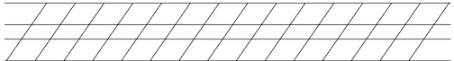

# Copperplate practice paper generator

`paper.eps` is an Encapsulated PostScript file for a sheet of
Copperplate calligraphy practice paper.

What's so useful about it? As it's a PS program, you can tweak the
parameters by modifying the text in the file. You can change
x-heights, slant angle, margins, etc.

## Background

I thought I'd have a go at copperplate calligraphy, as it looks rather
nice, and my handwriting is abysmal, so the idea of my hands producing
some actually pleasant writing seemed rather neat.

I bought a copy of "Mastering Copperplate Calligraphy" by Eleanor
Winters. The book describes how to produce practice paper by hand.
Where's the fun in that? I automated the process. I could have knocked
up something in Inkscape, but having a program allows me to tweak
parameters as I like.

## paper.pdf

For those who don't have ps2pdf installed, or an interest in
customising their practice paper, [`paper.pdf`](./paper.pdf) can be
used directly. It has fairly thick, dark lines that can be printed on
a guidesheet to pop under the sheet you're writing on.
